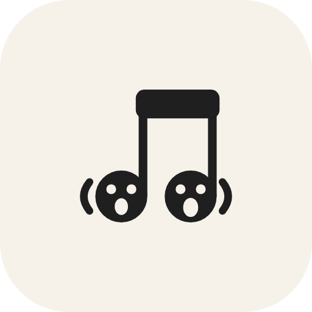
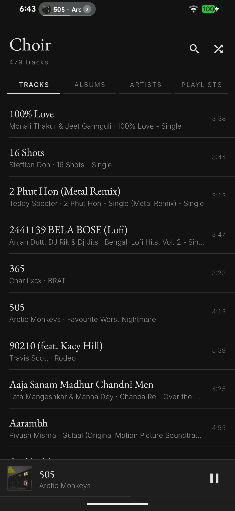
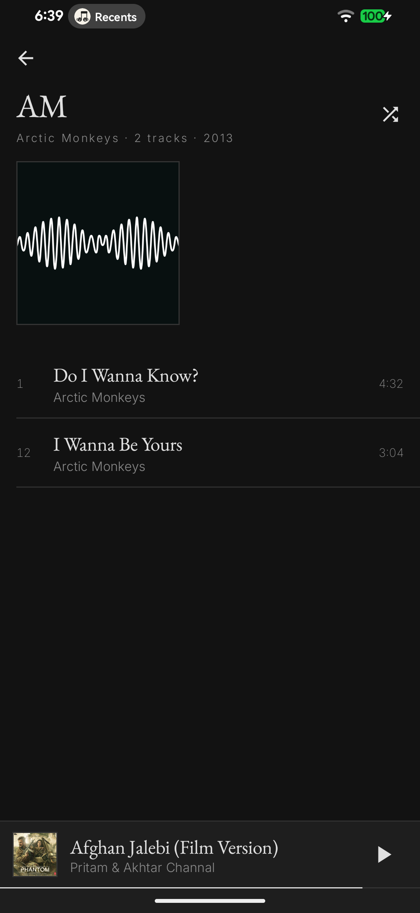
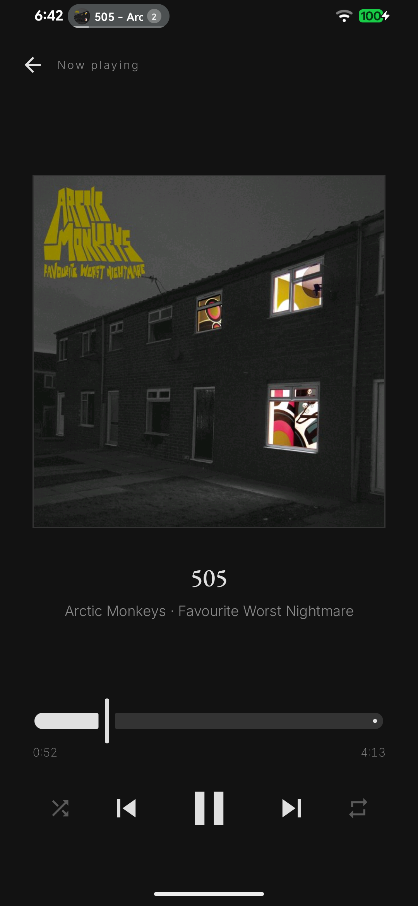

<p align="center">
  
</p>

<h1 align="center">Choir</h1>

<p align="center">
  A local-first music player for Android, ported from the AOSP Music app to
  Kotlin, Compose and Media3.
</p>

Choir plays the music on your device. No accounts, no streaming, no
recommendations, no telemetry, and no record of what you listen to. What you own
is what you hear.

Choir does hold the internet permission, for one optional feature: fetching
lyrics for tracks whose files have none. It is **off by default**, and while it
is off nothing in Choir opens a connection. Switch it on and what leaves the
device is a track's title, artist and length, sent to the lyric service you
picked — nothing about you, and nothing about the rest of your library.

The icon lives at [`docs/icon.svg`](docs/icon.svg) (source) and
[`docs/icon.png`](docs/icon.png) (512px, for embedding).

**Status: v0.4.0** — browsing, playlists, liked songs, lyrics, folder browsing
and multi-format audio; see [the roadmap](DOCS.md#roadmap) for what is coming.

<p align="center">
  
  
  
</p>

## What works today

- **Library** — tracks, albums, artists and playlists, read from MediaStore
- **Folders** — browse by directory instead, through a folder you grant. This is
  how you reach the files Android's media scanner never indexed at all
- **Playback** — gapless-capable ExoPlayer backend, audio focus, becoming-noisy
  handling, media notification, lock-screen and Bluetooth controls
- **Queue** — playing from an album, artist or search result queues *that* list;
  the queue survives a restart
- **Playlists** — create, rename, reorder by dragging, import and export `.m3u`
- **Liked songs** — a manual list, no algorithm, kept in Room
- **Lyrics** — read from `.lrc` sidecars and from ID3v2 and Vorbis tags, scrolled
  in time with the song; optionally fetched online, off by default
- **Formats** — everything Android guarantees, plus ALAC, Dolby, WavPack,
  Monkey's Audio and Windows Media where the FFmpeg decoder is built in. Choir
  brings its own readers for AIFF, WavPack, APE and ASF, because a decoder alone
  cannot open a container. Files the media scanner could not read are listed
  rather than hidden, and a track that will not play says why
- **Search** — instant filtering across titles, albums and artists
- **Picker** — Choir answers other apps' "choose a track" requests
- **Design** — monochrome throughout, with EB Garamond for content and Inter for
  chrome; hierarchy comes from type, never colour

## Releases

| Version | What it added |
| --- | --- |
| **0.4.0** | **Folder browsing** through a directory you grant, which is how you reach the files Android's media scanner refuses to index at all. **Demuxers written from scratch** for WavPack, Monkey's Audio and ASF — the three containers whose decoders shipped in 0.3.0 and played nothing, because nothing could open them. Exact seeking in APE, which keeps a seek table at the front of the file. |
| 0.3.0 | **Lyrics** — read from `.lrc` sidecars and from ID3v2, Vorbis, MP4 and WAV tags, scrolled in time with the song, down to the word where the file says so. Optionally fetched from LRCLIB, NetEase, Musixmatch or your own service, off by default and in an order you set. **Liked songs** and **editable playlists**, both re-linked if Android renumbers your library. `.m3u` import and export. **FFmpeg decoding** for ALAC and Dolby, an **AIFF reader** written from scratch, and a library that stops hiding the files Android's media scanner could not parse. Settings. |
| 0.2.0 | Albums, artists and search; drill-down screens; the audio picker other apps can call. |
| 0.1.0 | The port itself — Kotlin, Compose and Media3 in place of the AOSP Music app. Track list, now playing, transport controls, media notification, and a queue that survives a restart. |

## Testing

**367 unit tests**, run with `./gradlew test`. JUnit 5 with MockK and
Robolectric; Espresso and Compose UI testing for instrumented tests.

The weight sits where the bugs are — parsing other people's files, and deciding
what a file *is*:

| Area | Tests | What is checked |
| --- | ---: | --- |
| Container readers | 87 | ASF objects and packet payloads, APE headers and seek tables, WavPack blocks and resync, AIFF chunks and its 80-bit sample rate |
| ID3v2 and Vorbis comments | 29 | USLT/SYLT/TXXX frames, v2.2/2.3/2.4, synchsafe sizes, unsynchronisation, UTF‑16 BOMs, FLAC blocks, Ogg page reassembly |
| MP4 and WAV containers | 24 | iTunes `©lyr` and freeform atoms, metadata written after the audio, streams that refuse to `skip`, RIFF/AIFF chunk padding and byte order |
| LRC parsing | 34 | simple, enhanced and A2 word-level timestamps, `[offset:]`, binary search for the active line |
| Playlists and `.m3u` | 36 | round-trip fidelity, path and metadata resolution, reordering, re-linking after a MediaStore renumber |
| Lyric providers | 32 | request shape, response parsing, duration matching, failure paths — no network touched |
| Folder browsing | 30 | SAF document paths, tree building, `.nomedia`, and the files MediaStore never indexed |
| Audio formats | 31 | extension and MIME identification, which formats can actually play, and the codec fields the decoder is handed |
| Likes, queue, settings, utils | 64 | persistence, re-linking after a renumber, grouping, formatting |

Two things are deliberately not mocked. Parsing runs against byte fixtures built
in the tests themselves — tags, and now whole containers — so a fixture cannot
drift from the format it claims to represent. And the format table is checked
against what a real device reports: the entries were written after pushing files
in each format to a phone and reading back what the media scanner made of them,
not from documentation.

## Building

Requires JDK 17+ and the Android SDK (compileSdk 35).

```sh
./gradlew assembleDebug      # or: make debug / ./build.sh debug
./gradlew test               # unit tests
./gradlew installRelease     # build, sign and push to a connected device
```

Debug builds install as `app.auriel.choir.debug`, so one can sit beside a
release build on the same phone.

### Extra codecs

Choir builds and runs without FFmpeg, playing the formats Android guarantees.
To add the rest — ALAC, Dolby AC‑3 and E‑AC‑3, DTS, WavPack, Monkey's Audio and
Windows Media — build the Media3 FFmpeg decoder, which Google ships as source
rather than publishing to Maven:

```sh
tools/build-ffmpeg.sh                    # all four ABIs, needs a Linux host
tools/build-ffmpeg.sh arm64-v8a          # or just the one you are testing on
```

It downloads its own NDK, Media3 and FFmpeg into `~/choir-ffmpeg`, and leaves
`libffmpegJNI.so` in `app/src/main/jniLibs`. Settings then reports the decoder
as included, and the player picks it only for formats the device itself cannot
handle. See [DOCS](DOCS.md#audio-formats) for what this does and does not fix.

Release builds are signed from a git-ignored `keystore.properties` at the repo
root:

```properties
storeFile=your-key.jks
storePassword=…
keyAlias=…
keyPassword=…
```

Without that file the release build still completes — it simply goes unsigned.

## Licence

Choir is free software under the **GNU General Public License v3.0 or later**.
You may use, study, share and modify it; if you distribute a modified version,
it must stay free software under the same licence, source included.

Choir derives from the Android Open Source Project's Music app, which is Apache
2.0. See [NOTICE](NOTICE) for the full attribution, and [LICENSE](LICENSE) for
the GPL text.

## Contact

debadityamalakar@gmail.com
